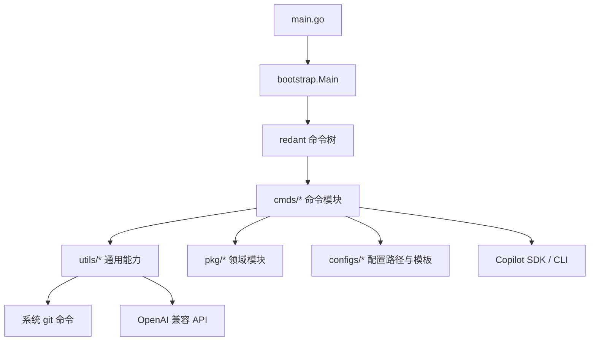
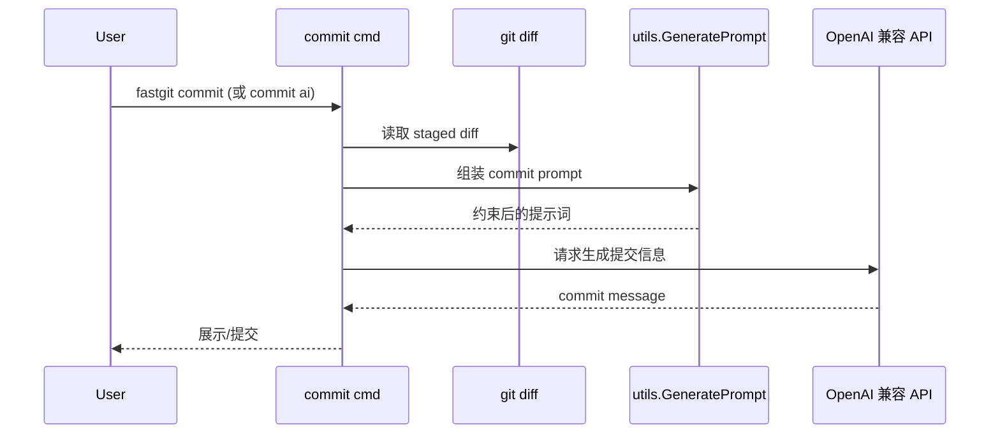

# fastgit 架构文档

## 文档目标

本文档面向“第一次接手 `fastgit` 的开发者”，回答三件事：

- 程序如何启动、命令如何注册与执行
- 配置、依赖注入、外部能力（Git/OpenAI/Copilot）如何接入
- 关键业务链路（AI 提交、changelog、Copilot 交互）如何串起来

---

## 1. 系统定位与边界

`fastgit` 是一个以 CLI 为核心的 Git 增强工具，重点能力包括：

- AI 生成提交信息（`fastgit commit`）
- changelog 维护与发布落版（`fastgit changelog *`）
- Copilot 会话集成（`fastgit copilot *`）
- PR 闭环（`fastgit pr *`）
- 质量门禁（`fastgit check *`）
- 本地代码评审（`fastgit review *`）
- 冲突助手（`fastgit conflict *`）
- 团队仓库规则（`.fastgit/` + `fastgit team *`）
- 常见 Git 工作流封装（`pull/push/tag/worktree/ggc`）

不在本项目内实现的能力：

- Git 仓库存储与版本控制引擎（依赖系统 `git`）
- 大模型服务本体（通过 OpenAI 兼容接口、Copilot CLI 调用）

---

## 2. 目录与分层

核心目录职责：

- `main.go`：程序入口，只做版本注入与启动。
- `bootstrap/`：应用装配层（命令注册、中间件、初始化配置、DI 注入）。
- `cmds/`：命令实现层，每个子目录对应一个命令域。
- `utils/`：通用基础能力（git shell、prompt 生成、OpenAI client、github release 等）。
- `pkg/aiprovider`：OpenAI / Copilot / fallback 统一接口，含 diff 摘要缓存（`cache.go`）
- `pkg/copilotperm`：Copilot 权限策略与 agentline broker
- `pkg/gitconflict`：冲突文件分组与摘要，可选 AI 冲突原因（`ai.go`）
- `pkg/workflow`：命令链记忆与 next-step 推荐
- `pkg/repoconfig`：`.fastgit` 团队规则加载与校验（含策略 enforce）
- `configs/`：配置模板与配置路径解析。

---

## 3. 启动流程

### 3.1 入口

- `main.go` 嵌入 `.version/VERSION` 并设置运行版本。
- 调用 `bootstrap.Main()` 进入命令装配。

### 3.2 命令装配

`bootstrap.Main()` 注册当前主命令：

- `version / init / upgrade / tag / ssh-login / history / ggc`
- `commit / check / review / conflict / pr / team / config / docs`
- `pull / push / worktree / changelog / copilot`

### 3.3 全局中间件

每次命令执行前都会经过统一中间件：

1. `--help` 直出帮助。
2. 检查 `stdin` 必须是终端（交互前提）。
3. `initConfig()`：初始化并校验配置文件。
4. 创建 `dix` 容器并注入：
   - 配置对象（`config.Load[configProvider]`）
   - `OpenaiClient`（`utils.NewOpenaiClient`）

---

## 4. 配置体系

配置由多层组成：

1. 全局配置：`~/.config/fastgit/config.yaml`
2. 全局环境模板：`~/.config/fastgit/env.yaml`
3. 仓库本地覆盖：`<repo>/.git/fastgit.env`
4. 仓库团队规则：`<repo>/.fastgit/policy.yaml`、`<repo>/.fastgit/commit.yaml`、`<repo>/.fastgit/check.yaml`

合并优先级：CLI flag > 仓库 `.fastgit/` > 本地 env > 全局配置 > 内置默认。

`.fastgit/` 三个文件职责：

- `policy.yaml`：分支命名、保护分支、conventional commit、敏感路径；`enforce: true` 时违规阻断。
- `commit.yaml`：AI commit 的 locale、长度、scope、团队 `types`、`candidates_default`。
- `check.yaml`：自定义质量门禁 `steps`（不存在时回落内置流水线）。

工作流记忆：`~/.config/fastgit/workflow.yaml`（记录命令转移频率，用于 next-step 推荐）

AI 缓存：`~/.config/fastgit/ai-cache/`（设置 `FASTGIT_AI_CACHE=1` 后按 prompt 哈希缓存补全结果）

初始化触发点：

- 启动中间件 `initConfig()`
- 显式执行 `fastgit init`

环境变量示例（AI 相关）：

- `OPENAI_API_KEY`
- `OPENAI_BASE_URL`
- `OPENAI_MODEL`
- `GITHUB_TOKEN`（Copilot 相关）
- `FASTGIT_AI_CACHE`（设为 `1/true/yes` 启用 diff 摘要缓存）

---

## 5. 关键运行链路

### 5.1 AI 提交信息（`commit`）

关键点：

- Prompt 模板由 `utils/prompts.go` 生成。
- 默认采用 conventional commit 格式约束。
- 提交前默认运行 `check run --staged-only`（`--skip-check` 跳过）。
- `.fastgit/policy.yaml` `enforce: true` 时，分支/消息违规阻断提交（`--skip-policy` 跳过）。
- push 前校验保护分支（`--override-policy` 跳过）。

### 5.x AIProvider 解析链路

所有 AI 命令统一经 `pkg/aiprovider`：

- `Default(client)`：`OpenAI → RuleFallback`，DI 注入给 `commit`。
- `ResolveProvider(name, dir)`：`auto|openai|copilot`，命令级选择（`pr/review/conflict` 用）。
- `auto` 链：`OpenAI → Copilot → RuleFallback`，逐级降级，保证 AI 不可用时仍可出规则结果。
- `WithCache` 包装：启用缓存后命中即返回，避免重复 token 消耗。

### 5.2 Changelog 工作流（`changelog`）

- `init`：生成 `.version/changelog` 与相关 prompt/instruction 模板。
- `draft`：基于 repo diff 构建 prompt，驱动 Copilot 维护 `Unreleased.md`。
- `release`：将 `Unreleased.md` 落版到版本文件，并可推进 `.version/VERSION`。

### 5.3 Copilot 会话工作流（`copilot`）

- 内部维护 runtime：`client` 复用 + `session` 缓存。
- 支持 `chat/resume/sessions/status/models/doctor/inspect/skills`。
- 默认进入 `agentline` 交互模式，命令与聊天在同一交互面协同。

---

## 6. 依赖注入与可扩展点

### 6.1 依赖注入

- DI 框架：`github.com/pubgo/dix/v2`
- 注入内容：配置对象、OpenAI 客户端等。
- 命令可通过上下文取得容器并注入参数结构体。

### 6.2 扩展命令

新增命令的标准路径：

1. 在 `cmds/<name>/cmd.go` 实现 `New() *redant.Command`
2. 在 `bootstrap/Main()` 注册
3. 如需共享能力，优先放到 `utils/` 或 `pkg/`

---

## 7. 外部依赖与集成点

- 系统 Git CLI：多数 Git 行为通过 shell 执行。
- OpenAI 兼容服务：提交信息生成与相关 AI 能力。
- Copilot SDK/CLI：`copilot` 命令族的会话管理与交互。
- GitHub Releases API：`upgrade` 自升级下载资产。

---

## 8. 架构阅读建议

建议按这个顺序读源码：

1. `main.go`
2. `bootstrap/boot.go` + `bootstrap/config.go`
3. `configs/config.go`
4. `cmds/fastcommitcmd`、`cmds/chglogcmd`、`cmds/copilotcmd`
5. `utils/git.go`、`utils/openai.go`、`utils/prompts.go`
6. `pkg/aiprovider`（统一 AI 接口与降级链）、`pkg/repoconfig`（团队规则与 enforce）

这样能最快建立“入口—装配—能力—业务链路”的全局心智模型。
