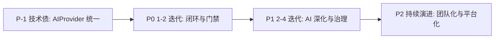

# fastgit 路线图（Git 增强 + AI）

## 目标与范围

本文档用于把 `fastgit` 从“单点好用”推进到“团队可落地”：

- 形成从本地改动到 PR 合并的闭环
- 将质量门禁（lint/test/安全）前置
- 将 AI 能力从“文案生成”升级为“流程助手”

> 关联文档：
>
> - 架构：`docs/architecture.md`
> - 功能总览：`docs/features.md`

---

## 优先级总览

- **P-1**：横切基础，避免每个 AI 命令重复选型与权限分叉
- **P0**：必须做，直接影响日常可用性与信任感
- **P1**：重要做，拉开与通用 Git 工具差异
- **P2**：长期做，支撑团队规模化落地

---

## P-1（横切基础，优先于新 AI 命令）

### 0) 统一 `AIProvider` 抽象

#### 背景

当前 commit 走 OpenAI 兼容 API（`utils/openai.go`），changelog/copilot 走 Copilot SDK。两套模型、权限、配置彼此独立。后续 `pr create`、`review`、冲突助手都会依赖 AI，若不先统一抽象，每个命令都要二选一，技术债会滚雪球。

#### 建议子能力

- 定义 `AIProvider` 接口：`Complete`、`Stream`、权限回调、模型/配置来源
- 适配器：`OpenAIProvider`、`CopilotProvider`
- 命令级 fallback：AI 不可用时退化为规则版（如无 AI 的 PR 模板、单条 commit 提示）
- 可选：diff 摘要缓存，控制 token 成本

#### Issue 拆分建议

- `refactor(ai): introduce AIProvider interface`
- `refactor(ai): migrate commit to AIProvider`
- `refactor(ai): migrate changelog draft to AIProvider`
- `feat(ai): add offline/rule-based fallback for pr and commit`

#### 验收标准（DoD）

- [x] 定义 `Provider` 接口与 `CompleteRequest/Response`（`pkg/aiprovider`）
- [x] `commit` 已迁移至 `AIProvider`，不再直接调用 OpenAI SDK
- [x] 规则 fallback：无 API key 时从 diff 生成 `chore: update N files`
- [x] `CopilotProvider` 适配器（`pkg/aiprovider/copilot.go`）
- [x] changelog draft 迁移至 `RunCopilotSession`
- [x] PR AI 增强（`pr create --ai`）
- [ ] Stream 接口与 diff 缓存
- [x] diff 摘要缓存（`FASTGIT_AI_CACHE=1`，`~/.config/fastgit/ai-cache/`）

---

## P0（建议优先）

### 1) `fastgit check` 统一质量门禁

#### 目标

在 commit/push 前提供一键质量检查，减少“提交后才失败”。

#### 建议子能力

- `fastgit check run`：执行 `fmt/lint/test/secrets`（可配置）
- `fastgit check run --staged-only`：只检查 staged 影响范围
- `fastgit check run --fix`：可自动修复的先修复（如 gofmt）
- `fastgit check run --dry-run`：只输出将执行的步骤，不改动仓库
- `fastgit check config`：展示当前门禁配置
- `fastgit check hook install|uninstall`：安装/卸载 pre-commit、pre-push 钩子（调用 `check run`）

#### Secret scan 选型（独立子任务）

与 fmt/lint/test 不同，secret scan 需明确引擎，建议二选一：

| 方案 | 优点 | 缺点 |
|------|------|------|
| 内嵌 gitleaks 规则 | 零外部依赖、可离线 | 规则维护成本 |
| 调用 trufflehog/gitleaks CLI | 成熟、社区规则全 | 需用户安装二进制 |

默认建议：检测 `gitleaks` / `trufflehog` 是否在 PATH，未安装时跳过并提示，不阻断其他步骤（可配置为 hard fail）。

#### 与 lefthook / husky / pre-commit 生态

- `fastgit check hook install` 写入 `# fastgit-managed` 标记的钩子脚本
- 不强制替换已有钩子；检测到非 fastgit 钩子时提示合并或 `--force`
- 团队可只用 `check run` 作为 CI/钩子被调用的引擎，钩子框架自选

#### Issue 拆分建议

- `feat(check): add check command group with dry-run`
- `feat(check): support staged-only mode`
- `feat(check): support auto-fix mode`
- `feat(check): add config file and defaults`
- `feat(check): add hook install/uninstall`
- `feat(check): integrate secret scan (gitleaks or trufflehog)`

#### 验收标准（DoD）

- [x] 在包含多包 Go 项目中，`check run` 能稳定执行并返回明确退出码
- [x] 失败项可读（指出失败阶段与摘要）
- [x] `--staged-only` 在无 staged 文件时给出可理解提示
- [x] `--dry-run` 不修改工作区、不安装钩子
- [x] 至少具备单元测试覆盖参数解析与执行分支

#### 当前进度

- [x] 命令骨架：`check run` / `check config` / `check hook`（MVP，含 dry-run）
- [x] 团队级 `.fastgit/check.yaml` 配置
- [x] staged-only 对 fmt/vet/test 分步过滤
- [x] secret scan：自动检测 gitleaks / trufflehog（staged 与全量）

---

### 2) `fastgit pr` 流程闭环（create/status/sync/merge）

#### 目标

补齐“本地改动 → 远端 PR → 合并”闭环，减少上下文切换。

#### 建议子能力

- `fastgit pr create`：自动生成 PR 标题、正文（含变更摘要、风险点、验证建议）
- `fastgit pr status`：查看当前分支 PR 状态（open/review/CI/checks）
- `fastgit pr sync`：rebase/sync 远端默认分支后更新 PR 描述
- `fastgit pr merge`：合并 PR（支持 squash/remerge 策略、合并后可选删分支、触发 changelog 提示）
- 全部支持 `--dry-run`

#### AI 生成内容结构（create/sync）

PR 正文建议固定小节，便于 review：

- Summary（变更摘要）
- Risk（风险点）
- Test plan（验证建议）
- Rollback（回滚建议，可选）

#### Issue 拆分建议

- `feat(pr): add pr create command with dry-run`
- `feat(pr): generate pr body from git diff + commits`
- `feat(pr): add pr status command`
- `feat(pr): add pr sync command`
- `feat(pr): add pr merge command`

#### 验收标准（DoD）

- [ ] 对无 upstream 的分支有清晰错误提示与引导
- [ ] PR 描述至少包含：变更点、风险点、验证建议
- [ ] 失败时不会误改本地分支状态
- [ ] 支持 dry-run 输出（便于审阅）
- [x] `pr merge` 需用户确认（默认交互确认，`--yes` 跳过）

#### 当前进度

- [x] 命令骨架：create/status/sync/merge + dry-run
- [x] 规则版 PR 正文（Summary/Risk/Test plan/Rollback）
- [x] AI 润色（`pr create --ai`，依赖 AIProvider）
- [x] sync 后自动更新 PR 正文（`pr sync --update-body [--ai]`）

---

### 3) 提交前钩子编排

#### 目标

把 `check` 变成默认路径：commit/push 前自动触发，失败可中断。

#### 建议子能力

- `fastgit check hook install`：pre-commit 调用 `check run --staged-only`
- 可选 pre-push：全量 `check run` 或仅 test
- 与 `fastgit commit` 集成：commit 前可选运行 check（`--skip-check` 可跳过）

#### 验收标准（DoD）

- [x] `fastgit commit` 默认在提交前运行 `check run --staged-only`（`--skip-check` 可跳过）
- [x] 安装后 `git commit` 触发 check（pre-commit），失败时 commit 中止
- [x] pre-push 钩子运行全量 `check run`
- [x] 卸载后移除 fastgit 管理的 pre-commit / pre-push
- [x] 文档说明与 lefthook 等共存方式（hook install --force）

> 实现载体：`check hook` 子命令（见 §1），不单独重复实现引擎。

---

### 4) Copilot 权限策略化（替代 ApproveAll）

#### 目标

将当前 MVP 权限模式升级为可控策略，降低风险。

#### 现状与复用点

- Copilot 主路径（chat/changelog）硬编码 `copilot.PermissionHandler.ApproveAll`
- `cmds/agentlineapp/acp/permission.go` 已有完整 `PermissionBroker`（allow once/always、deny、阻塞审批）
- **P0 重点**：把 Broker 接到 Copilot `OnPermissionRequest`，而非从零实现

#### 建议子能力

- `--permission-mode=ask|allow|deny`（默认 `ask`）
- 会话级与命令级覆盖
- 轻量审计日志（session id、tool name、时间、决策）
- changelog 等非交互命令默认 `ask` 或 `deny` 写操作，需显式 `--permission-mode=allow`

#### Issue 拆分建议

- `feat(copilot): add permission mode options`
- `feat(copilot): wire PermissionBroker to Copilot sessions`
- `feat(copilot): add lightweight audit log`

#### 验收标准（DoD）

- [x] 三种模式行为可预测且互斥（`pkg/copilotperm`）
- [x] 默认模式安全（copilot `ask`，changelog draft `deny`）
- [x] 日志可追溯到 session id + tool name（`~/.config/fastgit/audit.log`）
- [x] agentline TUI 与 Copilot chat 共用同一套策略配置（`ResolveMode` + TUI `/permission-mode` + 自动注入）

#### 当前进度

- [x] `--permission-mode=ask|allow|deny`
- [x] Copilot chat/resume/hydrate 接入策略 handler
- [x] changelog draft 默认 deny，需 `--permission-mode=allow` 才自动批准写操作
- [x] agentline `/permissions` `/allow` `/deny` 支持 Copilot 队列（`cperm_*`）

---

## P1（建议第二阶段）

### 5) AI 冲突助手（pull/rebase/merge）

#### 目标

把冲突处理从“只打开编辑器”升级为“可定位、可解释、可执行”。

#### 建议子能力

- 冲突文件按目录/模块分组
- 生成冲突原因摘要与处理建议（不自动改文件，需用户确认）
- 一键打开冲突文件列表 + 处理清单
- 与 `pull`、`ggc rebase` 集成

#### 验收标准（DoD）

- [x] 冲突场景下输出结构化摘要（文件、模块、建议）
- [x] `fastgit conflict list|open|summary`
- [x] `pull` 冲突时自动输出摘要
- [x] AI 生成冲突原因（`conflict summary --ai`，依赖 AIProvider）

#### 当前进度

- [x] `pkg/gitconflict` 分组 + 启发式建议
- [x] `fastgit conflict` 命令组

---

### 6) AI Commit 增强

#### 目标

将 commit 生成从“单条候选”升级为“多候选 + 风格一致 + 风险提示”。

#### 建议子能力

- 输出 3 条候选（短/中/规范 conventional）
- 识别 breaking change 并提示 `!` 或 BREAKING CHANGE footer
- 团队模板（scope、前缀、语言）— 读取 `.fastgit/commit.yaml` 或 `.github/prompts/commit-message.prompt.md`

#### 验收标准（DoD）

- [x] 候选消息具备可区分风格（`--candidates`：SHORT/MEDIUM/CONVENTIONAL）
- [x] breaking change 启发式提示
- [x] 团队模板（scope、前缀、语言）
- [x] `.fastgit/commit.yaml` 团队 types/locale + `candidates_default`
- [x] 默认启用多候选（全局 config + team init 默认 `candidates_default: true`，`--single` 逃生）

---

### 7) Changelog 智能增强

#### 目标

从“记流水”升级为“可发布信息”：风险、影响、验证、回滚。

#### 建议子能力

- draft 自动补充：影响范围 / 回滚建议 / 验证建议
- release 前校验 Unreleased 完整性
- 版本语义校验（bump 与改动类型一致性）

#### 验收标准（DoD）

- [x] draft 规则引擎补充影响/验证/回滚（`changelog draft --enrich`）
- [x] release 前校验 Unreleased 完整性（影响/验证/回滚，`--skip-validate` 逃生）
- [x] bump 与变更类型一致性校验（`--skip-bump-check` 逃生）

---

### 8) AI 本地代码评审

#### 目标

对 staged diff 输出结构化 review，补 PR 前自检环节。

#### 建议子能力

- `fastgit review staged`（或 `copilot review`）：潜在 bug、性能、可读性
- 输出分级：blocker / suggestion / nit
- 可选写入 PR 创建前的 checklist

#### 验收标准（DoD）

- [x] `fastgit review staged`：Blockers / Suggestions / Nits / Test plan
- [x] `--dry-run` 与 AI fallback（规则版）
- [x] 仅读取 staged diff，不修改代码
- [x] 与 `pr create` 可选联动（review 摘要写入 Test plan，`--review`）

---

### 9) 工作流记忆与下一步推荐

#### 目标

在现有 `ggc` workflow 持久化基础上，增加“常用链 → 推荐下一步”。

#### 现状

- `~/.config/fastgit/ggc.yaml` 已存 workflows + aliases
- 无 agent 长期记忆、无 pull→commit→push→pr 推荐

#### 建议子能力

- 记录命令序列频率（本地、可清除）
- 在 TUI/交互模式下推荐下一步（如 commit 成功后提示 `push` / `pr create`）
- 与 `ggc interactive` 集成

#### 验收标准（DoD）

- [x] 推荐基于真实使用频率（`workflow.yaml`）+ 默认链
- [x] commit/pull 完成后输出 `Next:` 提示
- [x] `ggc interactive` TUI 底部展示 workflow 推荐
- [x] 不发送数据到远端（本地文件）

#### 当前进度

- [x] `pkg/workflow` 记忆与推荐
- [ ] TUI 内展示推荐

---

## P2（持续演进）

### 10) 团队策略中心（Policy）

#### 配置载体（建议提前到 P0/P1 落地）

团队规则需进版本库、可仓库统一下发：

- 推荐路径：`.fastgit/policy.yaml`（或 `.fastgit.yaml` 内 `policy` 段）
- 个人覆盖：`~/.config/fastgit/config.yaml`
- 合并优先级：CLI flag > 本地 > 仓库 > 默认

#### 当前进度

- [x] `.fastgit/policy.yaml` + `.fastgit/commit.yaml` 模板（`fastgit team init`）
- [x] 分支/commit 校验（`fastgit team validate`）
- [x] `commit` / `check` / `pr create` 读取规则并 warning
- [x] 保护分支 push 硬阻断（`push` / `commit`，`--override-policy` 逃生）
- [x] commit/branch 策略 hard enforce（`policy.enforce: true`，`--skip-policy` 逃生）
- [ ] 违规自动修复建议

- 分支命名规则
- 提交信息规则（conventional、scope 必填）
- 保护分支（禁止直接 push main）
- 敏感路径拦截（`.env`、credentials）
- 违规提示与自动修复建议

---

### 11) 多仓 / 多 worktree 可视化

- 汇总多个仓库状态（待配置 repo 列表）
- 识别待同步、待发布、冲突风险
- 单仓 `worktree` 已有基础，dashboard 为跨仓视图

---

### 12) 可观测与审计平台化

- 操作审计（谁、何时、做了什么）— P0 轻量日志为起点
- AI 采纳率（建议是否被用户采用）
- 失败画像（check/pr/AI 最常见失败阶段）
- 企业扩展：SSO、权限审批流（长期，非当前 CLI 范围）

---

## 建议里程碑（8 周示例）

- **M0（第 0 周）**：`AIProvider` 接口草案 + commit/changelog 迁移计划
- **M1（第 1-2 周）**：`check` MVP（含 hook + dry-run）+ 基础测试
- **M2（第 3-4 周）**：`pr create/status` + dry-run；`.fastgit/policy.yaml`  schema 草案
- **M3（第 5-6 周）**：Copilot 权限策略（Broker 接入）+ 审计最小闭环
- **M4（第 7-8 周）**：`pr merge` + 冲突助手 / commit 增强 / review 三选一

---

## 开发执行建议

1. 先做命令骨架 + dry-run，后接真实执行。
2. 每个子命令都定义“失败可回退”路径。
3. 对 AI 生成内容提供“用户确认层”，避免静默执行高风险动作。
4. 每完成一块能力，补一段文档到 `features.md`（用户向）和 `architecture.md`（开发向）。
5. 横切任务（AIProvider、Policy 配置载体、测试基线）与功能命令并行规划，避免重复返工。

---

## 测试基线（横切）

团队治理工具需自身可信。建议为核心命令建立最低测试覆盖：

| 模块 | 最低要求 |
|------|----------|
| `check` | 参数解析、dry-run、staged-only 空集、退出码 |
| `pr` | dry-run 输出结构、无 upstream 错误 |
| `copilot` 权限 | 三种 mode 行为、审计日志字段 |
| `commit` | prompt 生成、多候选解析（P1） |

---

## 最小成功标准（阶段目标）

当以下条件满足，可认为“Git 增强 + AI”进入稳定实用期：

- [ ] 开发者从改动到 PR 可在 `fastgit` 内完成主要路径
- [ ] 提交前质量门禁可默认启用且失败可解释
- [ ] AI 能力在高风险动作上可控（权限策略 + 审计）
- [ ] AI 不可用时核心 Git 流程仍可完成
- [ ] 新成员可通过文档在 30 分钟内跑通核心流程
